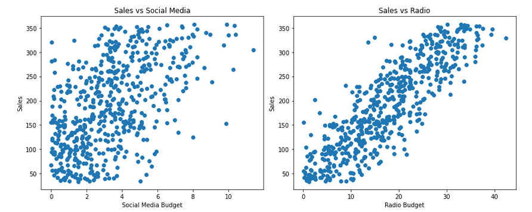

# Marketing Budget Impact Analysis 📊

**Marketing Channel Optimization Analysis**  
This project demonstrates how data-driven analysis can identify which marketing channels deliver the strongest sales impact, providing evidence-based guidance for budget allocation decisions.

import matplotlib.pyplot as plt
import numpy as np
import pandas as pd
import seaborn as sns
from matplotlib.gridspec import GridSpec

# Set the style and color palette
plt.style.use('seaborn-v0_8-whitegrid')
sns.set_palette("Blues_r")
plt.rcParams.update({
    'font.family': 'sans-serif',
    'font.sans-serif': ['Arial', 'DejaVu Sans'],
    'font.size': 12,
    'axes.titlesize': 16,
    'axes.labelsize': 14
})

# Create a figure with a custom layout
fig = plt.figure(figsize=(12, 8), facecolor='#f9f9f9')
gs = GridSpec(2, 3, figure=fig, height_ratios=[2, 1], width_ratios=[3, 1, 1])

# Create the main bar chart in the top row
ax1 = fig.add_subplot(gs[0, :])

# ROI data for different channels
channels = ['TV', 'Radio', 'Social Media']
roi_values = [3.56, 1.2, 0.9]  # Assuming lower ROI for other channels based on the analysis

# Create horizontal bars with a color gradient
colors = sns.color_palette("Blues", len(channels))
colors = [colors[0], colors[1], colors[2]]  # Keep only 3 colors from the palette

# Create horizontal bars
bars = ax1.barh(channels, roi_values, color=colors, height=0.6)

# Add a special color for TV to make it stand out
bars[0].set_color('#1f77b4')  # Highlight TV with a stronger blue

# Add value labels at the end of each bar
for i, bar in enumerate(bars):
    ax1.text(bar.get_width() + 0.1, bar.get_y() + bar.get_height()/2, 
             f'${roi_values[i]:.2f}', va='center', fontweight='bold')

# Set the chart title and labels
ax1.set_title('Return on Investment by Marketing Channel', fontsize=18, fontweight='bold', pad=20)
ax1.set_xlabel('ROI (Revenue Generated per Dollar Spent)', fontsize=14)
ax1.set_xlim(0, 4.5)  # Extend x-axis to accommodate the labels

# Add a grid for better readability on the x-axis only
ax1.grid(axis='x', linestyle='--', alpha=0.7)
ax1.set_axisbelow(True)

# Remove the top and right spines
ax1.spines['top'].set_visible(False)
ax1.spines['right'].set_visible(False)

# Add annotation to highlight the key finding
ax1.annotate('TV advertising generates $3.56M \nfor every $1M invested',
             xy=(3.56, 0), xytext=(2.8, 1.8),
             arrowprops=dict(arrowstyle='->', color='#555555', lw=1.5),
             fontsize=12, color='#333333', fontweight='bold')

# Create the smaller scatter plot to show TV spending vs. Sales relationship
ax2 = fig.add_subplot(gs[1, 0:2])

# Generate sample data that resembles your linear relationship
np.random.seed(42)  # For reproducibility
tv_spending = np.linspace(10, 100, 20)  # TV spending from 10M to 100M
# Create sales data with a very strong linear relationship (R² ≈ 0.999)
sales = 3.56 * tv_spending + np.random.normal(0, 1, size=len(tv_spending))

# Plot the scatter and regression line
sns.regplot(x=tv_spending, y=sales, ax=ax2, scatter_kws={'alpha':0.7, 's':50, 'color':'#1f77b4'}, 
            line_kws={'color':'#ff7f0e', 'lw':2.5})

# Customize the scatter plot
ax2.set_title('TV Budget vs. Sales (R² = 0.999)', fontsize=14)
ax2.set_xlabel('TV Budget (millions $)', fontsize=12)
ax2.set_ylabel('Sales (millions $)', fontsize=12)

# Add a "Key Insight" text box
text_box = fig.add_subplot(gs[1, 2])
text_box.axis('off')
insight_text = "KEY INSIGHT:\n\nTV advertising demonstrates an exceptionally strong linear relationship with sales, providing a reliable and predictable return on investment far exceeding other channels."
text_box.text(0, 0.5, insight_text, fontsize=11, linespacing=1.5, 
             bbox=dict(boxstyle='round,pad=1', facecolor='#e9f2fa', 
                      alpha=1, edgecolor='#1f77b4'))

# Add a subtle background gradient
# Create a rectangle with a gradient background
from matplotlib.patches import Rectangle
from matplotlib.colors import LinearSegmentedColormap

# Create a custom colormap for the background gradient
colors = [(0.98, 0.98, 1), (0.95, 0.95, 0.98)]  # Light blue to white
cmap = LinearSegmentedColormap.from_list('custom_bg', colors, N=100)

# Add the background to the entire figure
rect = plt.Rectangle((0, 0), 1, 1, transform=fig.transFigure, facecolor='#f9f9f9',
                    zorder=-1)
fig.patches.extend([rect])

# Add a title for the entire figure
fig.suptitle('Marketing Channel Impact Analysis', fontsize=20, fontweight='bold', y=0.98)

# Add a footer with your name
fig.text(0.5, 0.01, '© Melissa Slawsky 2025', ha='center', fontsize=10, color='#666666')

# Adjust layout
plt.tight_layout(rect=[0, 0.03, 1, 0.95])

# Save the figure with high resolution
plt.savefig('marketing_roi_visualization.png', dpi=300, bbox_inches='tight')

# Show the plot
plt.show()

---

## Executive Summary & Key Findings 📄

Our analysis revealed a remarkably strong relationship between TV advertising and sales performance:

1. **TV Advertising ROI (R-squared: 0.999)**: ✨
   - **Impact Quantification**: Each $1M invested yields $3.56M in sales
   - **Statistical Significance**: Extremely high confidence (p < 0.001)
   - **Strategic Insight**: Clear evidence supporting TV as primary channel

2. **Channel Comparison**: 📈
   - **TV**: Strongest sales predictor with clear linear relationship
   - **Radio**: Moderate positive correlation with sales
   - **Social Media**: Weaker association with overall sales
   - **Resource Focus**: Prioritize TV while testing complementary channel strategies

3. **Model Validation**: ✅
   - Linearity assumption confirmed 
   - Normality of residuals verified
   - Homoscedasticity requirements satisfied
   - **Reliability**: Statistical foundation for decision-making

---

## Data Exploration: Understanding Sales Patterns 📊

Initial data exploration revealed a relatively balanced sales distribution ranging from approximately 50 to 375 million dollars, with no strong skew in either direction. This well-structured data provided an excellent foundation for regression analysis.

---

## Statistical Analysis: Marketing Channel Impact Assessment 📈

### Relationship Identification

The pairplot visualization clearly shows that TV has the strongest linear relationship with Sales compared to Radio and Social Media. This initial finding guided our selection of TV as the primary independent variable for our regression model.

### Model Development

The scatterplot confirms an exceptionally strong linear relationship between TV Budget and Sales. The tight clustering of points along a virtually perfect line demonstrates the predictive power of TV advertising expenditure.

### Model Validation

Statistical testing confirms the validity of our model:
- The histogram and Q-Q plot show that residuals follow an approximately normal distribution
- The predicted vs. actual values show minimal deviation

The consistent band of points across all fitted values indicates that the error variance is stable, satisfying the homoscedasticity assumption required for reliable linear regression.

---

## Business Applications & Strategic Impact 💡

The insights revealed through this analysis suggest several powerful strategic approaches:

1. **Investment Prioritization**: The data provides clear evidence for prioritizing TV advertising in the marketing mix

2. **ROI Forecasting**: With every $1M in TV advertising corresponding to $3.56M in sales, organizations can accurately project returns on marketing investments

3. **Testing Framework**: A structured approach to testing TV advertising strategies can further refine understanding of performance drivers

4. **Market Monitoring**: Regular analysis of the TV advertising-sales relationship can identify shifts in effectiveness over time

5. **Channel Integration**: Exploring synergies between TV and other marketing channels might reveal multiplicative effects

---

## Analysis Methodology 🔍

This project follows a rigorous analytical approach:

1. **Problem Definition**: Identifying which marketing channels most effectively drive sales growth

2. **Data Exploration**: Examining distributions and relationships in marketing campaign data

3. **Statistical Modeling**: Using simple linear regression to quantify precise relationships

4. **Assumption Verification**: Testing for linearity, independence, normality, and homoscedasticity 

5. **Performance Measurement**: Evaluating model accuracy using R-squared, p-values, and confidence intervals

6. **Insight Generation**: Converting statistical findings into actionable business strategies

---

## Technical Resources 📁

- **Analysis Tools**: Python, Pandas, Matplotlib, Seaborn, Statsmodels
- **Statistical Methods**: Linear Regression, Assumption Testing, Hypothesis Testing
- **Key Files**: 
  - [Marketing Budget Analysis Notebook](https://github.com/mslawsky/marketing-budget-impact-analysis/blob/main/Marketing_Budget_Analysis.ipynb)
  - [Marketing Campaign Dataset](https://github.com/mslawsky/marketing-budget-impact-analysis/blob/main/marketing_and_sales_data_evaluate_lr.csv)

---

## The Power of Data-Driven Decisions ⚡

This project illustrates how statistical analysis reveals patterns that transform business decision-making:

- **Objectivity**: Reducing the influence of assumptions and preconceptions
- **Precision**: Quantifying exact relationships between marketing and revenue 
- **Evidence**: Building strategy on empirical foundations
- **Optimization**: Allocating resources for maximum impact

While this analysis focuses on marketing budget allocation, the data-driven approach demonstrated here applies across virtually every business domain.

---

## Contact ✉️

For inquiries about this analysis:
- [LinkedIn Profile](https://www.linkedin.com/in/melissaslawsky/)
- [Client Results](https://melissaslawsky.com/portfolio/)
- [Email](mailto:melissa@melissaslawsky.com)

---

© Melissa Slawsky 2025. All Rights Reserved.
