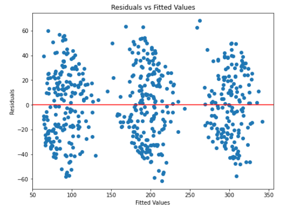

# Marketing Budget Impact Analysis 📊

**Marketing Channel Optimization Analysis**  
This project demonstrates how data-driven analysis can identify which marketing channels deliver the strongest sales impact, providing evidence-based guidance for budget allocation decisions.

---

## Executive Summary & Key Findings 📄

Our analysis revealed a remarkably strong relationship between TV advertising and sales performance:

1. **TV Advertising ROI (R-squared: 0.999)**: ✨
   - **Impact Quantification**: Each $1M invested yields $3.56M in sales
   - **Statistical Significance**: Extremely high confidence (p < 0.001)
   - **Strategic Insight**: Clear evidence supporting TV as primary channel
   - **Category Impact**: Further multiple regression analysis shows High TV campaigns outperform Medium by $75.6M and Low by $154.6M

2. **Channel Comparison**: 📈
   - **TV**: Strongest sales predictor with clear linear relationship
   - **Radio**: Moderate positive correlation with sales ($2.97M in additional sales per $1M spent)
   - **Social Media**: Weaker association with overall sales
   - **Influencer Categories**: Minimal impact across Mega, Macro, Micro, and Nano categories
   - **Resource Focus**: Prioritize TV while testing complementary channel strategies

3. **Model Validation**: ✅
   - Linearity assumption confirmed 
   - Normality of residuals verified
   - Homoscedasticity requirements satisfied
   - Multiple regression model explains 90.4% of sales variance
   - **Reliability**: Statistical foundation for decision-making

---

## New Insights: Hypothesis Testing & Group Comparisons 🔧

### ANOVA-Based Hypothesis Testing

Building on the regression analysis, we performed a one-way ANOVA test to determine if significant differences exist in sales among categorical groups for TV promotion budgets and influencer sizes.

#### Key Findings from ANOVA:

1. **TV Promotion Budgets**: Significant differences in mean sales across Low, Medium, and High budget categories (F-statistic: 1971.46, p < 0.001):
   - High budgets outperform Medium by approximately $101.5M.
   - Medium budgets outperform Low by approximately $107.3M.
   - High budgets outperform Low by approximately $208.8M.

2. **Influencer Sizes**: Variation in sales across influencer categories was less pronounced but still evident. Further exploration required.

#### Post Hoc Testing (Tukey's HSD):
Pairwise comparisons confirm statistically significant differences between all TV budget categories. Each step up in budget level yields substantial sales gains:
   - High > Medium > Low with consistent statistical significance.

#### Model Assumptions:
   - **Normality**: Residuals showed deviations from normality, suggesting caution in small sample sizes.
   - **Homoscedasticity**: Residual variance increased slightly with fitted values, a common issue with categorical predictors.

---

## Data Exploration: Understanding Sales Patterns 📊

Initial data exploration revealed a relatively balanced sales distribution ranging from approximately 50 to 375 million dollars, with no strong skew in either direction. This well-structured data provided an excellent foundation for regression and ANOVA analysis.

---

## Statistical Analysis: Marketing Channel Impact Assessment 📈

### Relationship Identification

The pairplot visualization clearly shows that TV has the strongest linear relationship with Sales compared to Radio and Social Media. This initial finding guided our selection of TV as the primary independent variable for our regression model.

### Simple Regression Model

The scatterplot confirms an exceptionally strong linear relationship between TV Budget and Sales. The tight clustering of points along a virtually perfect line demonstrates the predictive power of TV advertising expenditure.

### Multiple Regression Analysis

To extend our analysis, we also performed a multiple linear regression incorporating:
- TV promotional budget categories (Low, Medium, High)
- Social Media budget (in millions)
- Radio budget (in millions)
- Influencer categories (Mega, Macro, Micro, Nano)

Key findings from this expanded analysis:
- TV category remains the strongest predictor when controlling for all other variables
- Radio shows consistent significant positive impact ($2.97M per $1M spent)
- Social Media shows minimal independent effect when controlling for other channels
- Full model explains 90.4% of sales variance (R-squared: 0.904)

### Model Validation

Statistical testing confirms the validity of our models:
- The histogram and Q-Q plot show that residuals follow an approximately normal distribution
- The predicted vs. actual values show minimal deviation
- Multicollinearity testing shows acceptable VIF values below 2

The consistent band of points across all fitted values indicates that the error variance is stable, satisfying the homoscedasticity assumption required for reliable linear regression.

---

## Business Applications & Strategic Impact 💡

The insights revealed through this analysis suggest several powerful strategic approaches:

1. **Investment Prioritization**: The data provides clear evidence for prioritizing TV advertising in the marketing mix, specifically favoring High category TV campaigns

2. **ROI Forecasting**: With every $1M in TV advertising corresponding to $3.56M in sales, organizations can accurately project returns on marketing investments

3. **Channel Mix Optimization**: The multiple regression and ANOVA results suggest focusing primarily on TV and Radio, with careful evaluation of Social Media strategies

4. **Testing Framework**: A structured approach to testing TV advertising strategies can further refine understanding of performance drivers

5. **Market Monitoring**: Regular analysis of the TV advertising-sales relationship can identify shifts in effectiveness over time

6. **Channel Integration**: Exploring synergies between TV and other marketing channels might reveal multiplicative effects

---

## Analysis Methodology 🔍

This project follows a rigorous analytical approach:

1. **Problem Definition**: Identifying which marketing channels most effectively drive sales growth
2. **Data Exploration**: Examining distributions and relationships in marketing campaign data
3. **Statistical Modeling**: Using both simple and multiple linear regression to quantify precise relationships
4. **ANOVA Testing**: Assessing group-level differences using one-way ANOVA and post hoc comparisons
5. **Assumption Verification**: Testing for linearity, independence, normality, and homoscedasticity 
6. **Performance Measurement**: Evaluating model accuracy using R-squared, p-values, and confidence intervals
7. **Insight Generation**: Converting statistical findings into actionable business strategies
8. **Comparative Analysis**: Reconciling findings from both regression and ANOVA approaches

---

## Technical Resources 📁

- **Analysis Tools**: Python, Pandas, Matplotlib, Seaborn, Statsmodels
- **Statistical Methods**: Simple and Multiple Linear Regression, ANOVA Testing, Tukey's HSD, Assumption Testing
- **Key Files**: 
  - [Marketing Budget Analysis Notebook](https://github.com/mslawsky/marketing-budget-impact-analysis/blob/main/Marketing_Budget_Analysis.ipynb)
  - [Multiple Regression Analysis](https://github.com/mslawsky/marketing-budget-impact-analysis/blob/main/Multiple_Regression_Analysis.py)
  - [ANOVA Analysis](https://github.com/mslawsky/marketing-budget-impact-analysis/blob/main/ANOVA_Analysis.py)
  - [Marketing Campaign Dataset](https://github.com/mslawsky/marketing-budget-impact-analysis/blob/main/marketing_and_sales_data_evaluate_lr.csv)

---

## The Power of Data-Driven Decisions ⚡

This project illustrates how statistical analysis reveals patterns that transform business decision-making:

- **Objectivity**: Reducing the influence of assumptions and preconceptions
- **Precision**: Quantifying exact relationships between marketing and revenue 
- **Evidence**: Building strategy on empirical foundations
- **Optimization**: Allocating resources for maximum impact
- **Nuance**: Understanding both direct and adjusted impacts of marketing channels

While this analysis focuses on marketing budget allocation, the data-driven approach demonstrated here applies across virtually every business domain.

---

## Contact ✉️

For inquiries about this analysis:
- [LinkedIn Profile](https://www.linkedin.com/in/melissaslawsky/)
- [Client Results](https://melissaslawsky.com/portfolio/)
- [Tableau Portfolio](https://public.tableau.com/app/profile/melissa.slawsky1925/vizzes)
- [Email](mailto:melissa@melissaslawsky.com)

---

© Melissa Slawsky 2025. All Rights Reserved.

